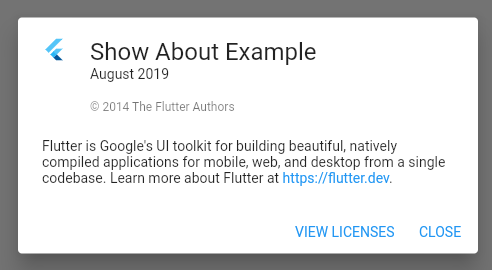
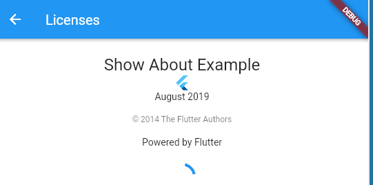

# **License Page for Flutter Apps**

## 😀

---

# What I Expected

"I am going to have to manually add a bunch of widgets to get a license page"

---

# What happened

1. It is REALLY simple, the framework has widgets and functions to do it for you.

---

# How to do it

Decide on which of the two simple way you want to use:

- The `showLicensePage()` and/or `showAboutDialog()` functions.


- The `AboutListTile` class.


---

# The function

```dart
child: ElevatedButton(
          child: const Text('About this app'),
          onPressed: () {
            showAboutDialog(
              context: context,
              applicationIcon: const FlutterLogo(),
              applicationName: 'Hehe haha',
              applicationVersion: 'January 1970',
              applicationLegalese: '\u{a9} 2000 Jane Doe',
              children: aboutBoxChildren, // Add more widgets to the modal!
            );
          },
        ),
```

---

# The class

```dart
drawer: Drawer(
        child: SingleChildScrollView(
          child: SafeArea(
            child: AboutListTile(
              icon: const Icon(Icons.info),
              applicationIcon: const FlutterLogo(),
              applicationName: 'Hehe haha',
              applicationVersion: 'January 1970',
              applicationLegalese: '\u{a9} 2000 Jane Doe',
              aboutBoxChildren: aboutBoxChildren,
            ),
          ),
        ),
      ),
```

---

# Result



