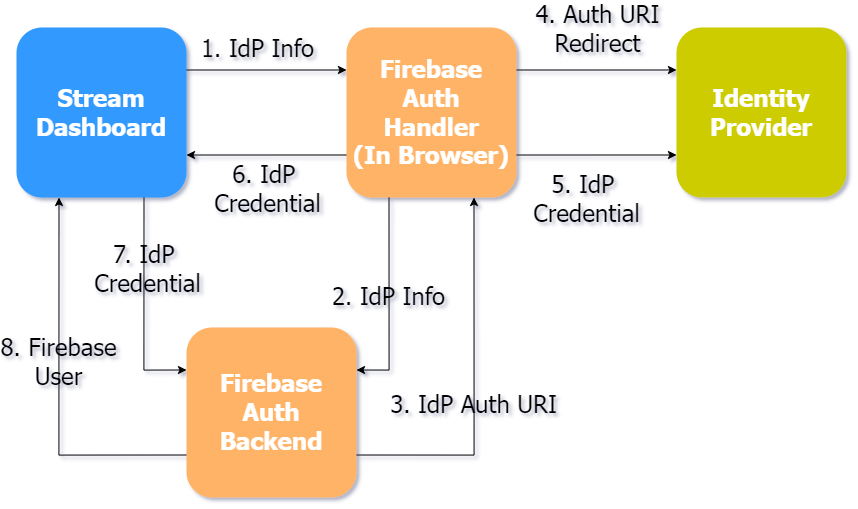
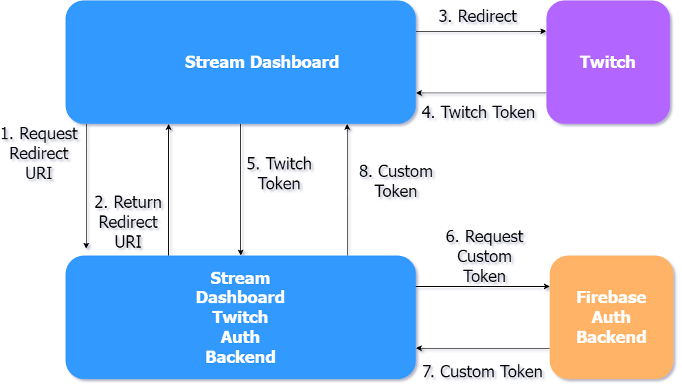

# **3rd party login for Stream Dashboard**

## 😀

---

# What I Expected

"Implementing social sign up/log in will be complex"

---

# What happened

1. It was really simple for the offered social platforms.
2. It is not so simple for other platforms (Twitch)

---

# Straightforward integrations

Google, Facebook, Apple, Twitter, Github, Microsoft, Yahoo, **No Twitch 😢**

```js
import { getAuth, signInWithPopup, GoogleAuthProvider } from "firebase/auth";

const auth = getAuth();
signInWithPopup(auth, provider)
  .then((result) => {
    // ...
  })
  .catch((error) => {
    // ...
  });
```

---

# "First party" integrations



---

# Twitch integration



---

# Twitch integration

After that, you can log in!

```js
import { getAuth, signInWithCustomToken } from "firebase/auth";

const auth = getAuth();
signInWithCustomToken(auth, token)
  .then((userCredential) => {
    // ...
  })
  .catch((error) => {
    // ...
  });
```

---

# Outcome

Maybe we can implement Twitch Log In/Sign Up now that we understand some of the details?

<!-- footer: Diagrams based on Firebase Authentication: From fully managed to fully customizable-->
