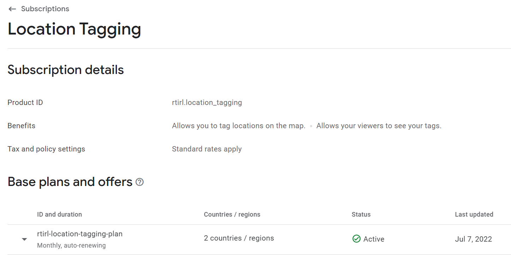
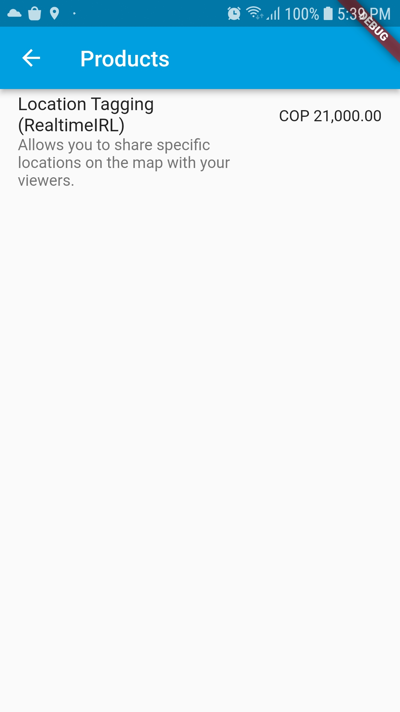
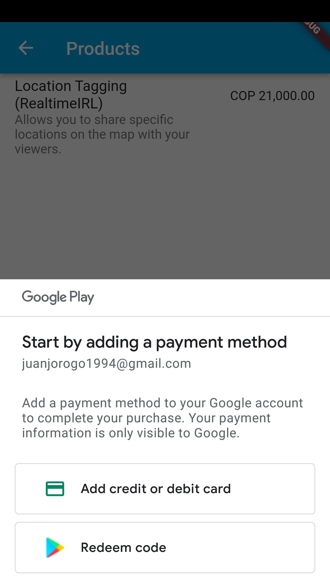
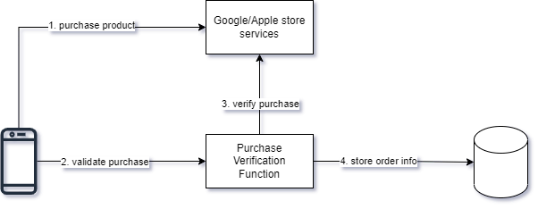
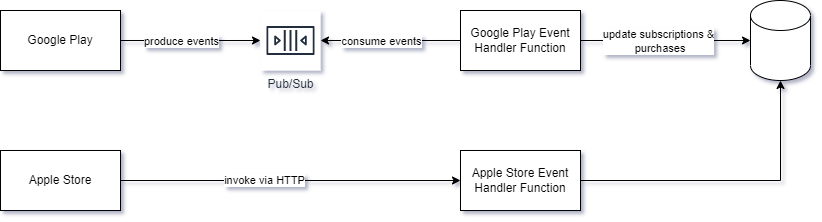

# **IAPs in Flutter**

## 🤳

---

# What I Expected

It is probably complex because of having two stores and stuff

---

# What happened

- There are many steps
- 😮‍💨 It is annoying to test???????????????????????????
  - Might be that im just dumb

---

# How to do it

1. Register your products on the Play/App Store console. (Which can't be removed afterward 😐)
2. In the Flutter app: Add some code to retrieve product information and perform purchases.
3. In the backend: Add some code so that purchases can be verified.

---

# Register Product on play store



---

# Add some Dart

The basic important things are:

```dart
final storeConnection = InAppPurchase.instance;

// List of product IDs
const ids = <String>{
  "rtirl.location_tagging",
};

// Get product details, then you can list whan users can pay for :)
storeConnection.queryProductDetails(ids);
```

---

# Add some more Dart

```dart
final purchaseParam = PurchaseParam(productDetails: product.productDetails);

// Buy the thing
await iapConnection.buyNonConsumable(purchaseParam: purchaseParam);

// After this you should verify the purchase with the backend :)
```

---

# That would look like this




---

# Purchase verification



---

# Handle other store events



Also might want a scheduled task to clear expiring subs.

---

# Conclusions

- Not super complex
- Testing seems to be annoying if you don't have the signing information!!!111!!111
