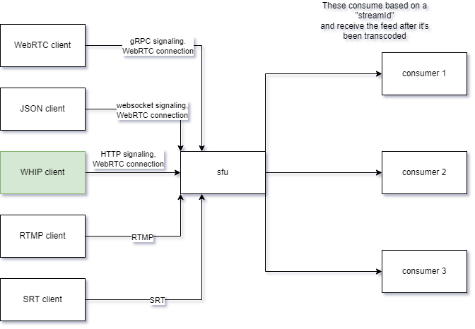

# **WHIP**

---

# What I Expected

I barely know the webrtc concepts, pion api and go :)

---

# What happened

- Previous slide is 110% accurate. 😬
- I have spent many hours running the SFU on Github Codespaces, Docker on my machine and finally WSL2. WSL2 is the easiest because I don't have to deal with Docker's NAT and even add code to the SFU to make it work.
- I can establish a WebRTC connection using a WHIP endpoint 😮‍💨
  - Without wiring it to the transcoding flow of the SFU though 😢

---

# Muxable's SFU

---

# What is WHIP

A standard to create create a Send Only WebRTC peer (WHIP client) and connect it to a receiver (WHIP server)

Why? WebRTC doesn't specify how to do signaling and connection two peers, so there are many non standard implementations, which make it easier to get started and harms adoption, from what everyone says?

---

# How to do WHIP

1. Create a _WHIP endpoint_, which is a HTTP endpoint that recieves POST requests that include the SDP (describes the peers capabilities in terms of codecs and more stuff), then the server answers with the response offer (another SDP string) and the URL of the _WHIP resource_.

This pretty much makes the server ready to accept a connection from the WHIP client.

---

# How to do WHIP

2. Once the client has received a response from the WHIP endpoint, it can initiate the WebRTC connection using the information in the SDP string.

The URL of the WHIP resourced is held by the client so that it can finalize the session using a HTTP DELETE.

---

# Conclusions

- WHIP itself is simple.
- WebRTC on Docker is not that noob friendly.
